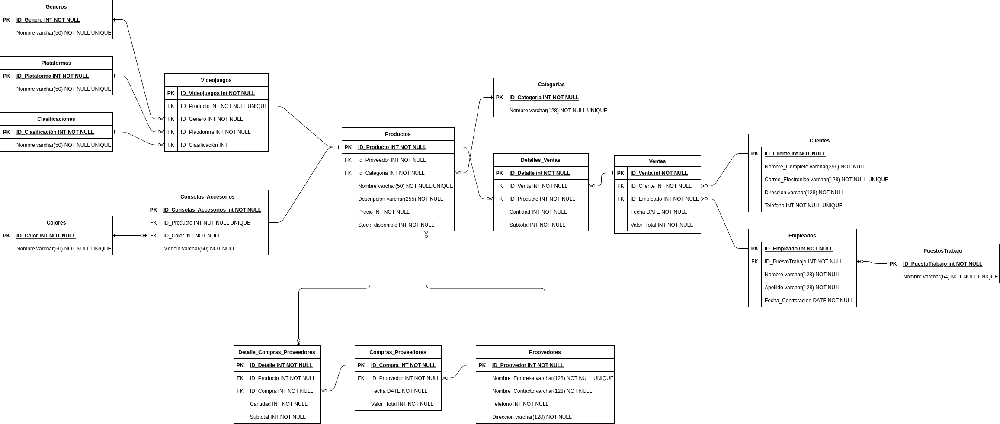

# MISSION 01 - START!

## DISCLAIMER

Para asegurar el correcto funcionamiento de las consultas adjuntas en el presente `README` es necesario, ademas de ejecutar los comandos `DDL` y `DML`, ejecutar los comandos en `Funciones.sql` y `Procedimientos.sql` en el orden nombrado.

## Diagrama E-R UML Resultante



## Consultas

### 1 - Listar todos los videojuegos de una plataforma específica (por ejemplo, "PlayStation").

```sql
CALL VideojuegosPorPlataforma("PS5")
```

### 2 - Obtener todos los productos en una categoría (videojuegos, consolas o accesorios) cuyo stock sea inferior a un valor dado.

```sql
CALL ProductosMennoresStock("Consola", 11)
```

### 3 - Mostrar todas las ventas realizadas por un cliente específico en un rango de fechas.

```sql
CALL ClienteEspFecha(6, "2024-08-30", "2024-10-30")
```

### 4 - Calcular el total de ventas de un empleado en un mes dado.

```sql
CALL EmpleadoMesVentas(3, "September")
```

### 5 - Listar los productos más vendidos en un período determinado.

```sql
CALL ProductosPeriodo("2024-09-24", "2024-09-26")
```

### 6 - Consultar el stock disponible de un producto por su nombre.

```sql
CALL ProductoStock("Zelda: Breath of the Wild")
```

### 7- Mostrar las órdenes de compra realizadas a un proveedor específico en el último año.

```sql
CALL CompraProveedorAño()
```

### 8 - Listar los empleados que han trabajado más de un año en la tienda.

```sql
CALL EmpleadosMasDeUnAño()
```

### 9 - Obtener la cantidad total de productos vendidos en un día específico.

```sql
CALL TotalProductosVendidosEnUnDia('2024-09-28')
```

### 10 - Consultar las ventas de un producto específico (por nombre o ID) y cuántas unidades se vendieron.

```sql
CALL VentasXProducto(1)
```
